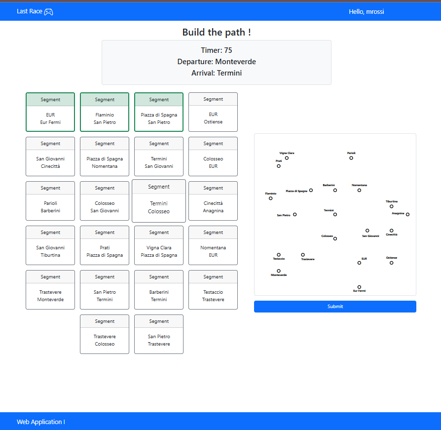
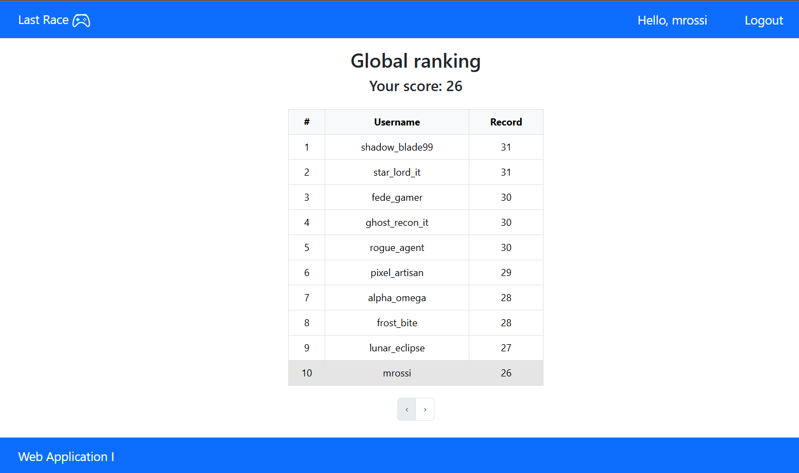

# Exam #1: "Last Race"
## Student: s358318 Maugeri Davide 

## React Client Application Routes
- Route `/`: shows game instructions and the complete underground map. It offers the possibility to login in, logout, see the best scores and start a new game. 
- Route `/login`: shows the login form.
- Route `/ranking`: shows the global ranking.
- Route `/game`: allows users to play the game and to compute a solution. It shows: a timer, the initial and final station, the underground map with only the stations and all the possible segments. 
- Route `/game-solution`: shows if the proposed solution is correct or not. In affermative case, it displays the solution with the events and its effects, otherwise, it display a valid solution. It offers the possibility to start a new game.
- Route `/error`: shows the error that occurs during the execution of the application.
- Route `/*`: for all the other routes

## API Server
### Game
GET `/api/game/underground`
- Auth: user identified via passport session
- Request body: none
- Response body: 
  ```
  {
    "stations": {
      "1": {
        "name": "Termini",
        "station_x": 500,
        "station_y": 500,
        "name_x": 460,
        "name_y": 480,
        "id_lines": [1, 2]
      },
      ...
    },

    "lines": {
      "1": {
        "name": "Linea Rossa",
        "color": "red"
      },
      ...
    },

    "segments": {
      "1": {
        "id_station1": 8,
        "id_station2": 5,
        "id_line": 1
      },
      ...
    }
  }
  ```
- Code: `200 OK`, `401 Unauthorized`, `500 Internal Server Error`

POST `api/game/start`
- Auth: user identified via passport session
- Request body: none
- Response body: 
  ```
  {
    "departure": "8",
    "arrival": "12",
    "timeLimit": 90
  }
  ```
- Code: `200 OK`, `401 Unauthorized`, `409 Conflict`, `500 Internal Server Error`

POST `api/game/submit`
- Auth: user identified via passport session
- Request body:
   ```
  {
    "segmentsId": ["8", "3", "2", "9"]
  }
  ```
- Response body: 
  ```
  Case: fail
  {
    "valid": false,
    "coins": 0,
    "events": [],
    "possibleSolution": ["4", "5", "1"]
  }

  Case: success
  {
    "valid": true,
    "coins": 23,
    "events": [
      {
        "id": 4,
        "description": "Smooth ride: the train is perfectly on time!",
        "effect": 0
      }, 
      ...
    ],
    "possibleSolution": []
  }

  ```
- Code: `200 OK`, `400 Bad Request`, `401 Unauthorized`, `500 Internal Server Error`


GET `/api/best-scores`
- Auth: user identified via passport session
- Request body: none
- Response body: 
  ```
  "ranking": [
    {
      "username": "shadow_blade99",
      "best_score": 31
    },
    ...
  ]
  ```
- Code: `200 OK`, `400 Bad Request`, `401 Unauthorized`, `500 Internal Server Error`

### Session
POST `/api/sessions`
- Request body:
  ```
  {
    "email": "mariorossi@libero.it",
    "password": "mypassword"
  }
  ```
- Response body: none
- Code: `200 OK`, `401 Unauthorized`, `500 Internal Server Error`  

GET `/api/sessions/current`
- request body: none
- response body:
  ```
  {
  "id": 1,
  "email": "mariorossi@libero.it",
  "username": "mrossi",
  "best_score": 26
  } 
  ```
- Code: `200 OK`, `401 Unauthorized`, `500 Internal Server Error`

DELETE `/api/sessions/current`
  - request body: none
  - response body: none
  - code: `200 OK`,  `401 Unauthorized`, `500 Internal Server Error` 


## Database Tables
- Table `users` - contains id, email, username, best_score, hashed_password, salt
- Table `stations` - contains id, name, station_x, station_y, name_x, name_y
- Table `lines` - contains id, name, color
- Table `segments` - contains id, id_station1, id_station2, id_line
- Table `events` - contains id, description, effect

## Data Models
### Underground
```
{
  stations: {...},
  lines: {...},
  segments: {...}
}
```
## Main React Components
- `LoginForm` (in `LoginForm.jsx`): allows user to log in.
- `StartGamePage` (in `App.jsx`): shows the homepage. 
- `GameMap` (in `Game.jsx`): shows the underground map.
- `GameCards` (in `Game.jsx`): shows the list of all the possible segments. It is used to compute the solution.
- `GameSession` (in `Game.jsx`) shows the cards and underground map with only the stations for computing the solution. 
- `GameResult` (in `Game.jsx`): shows the results of the last game session. It includes the earned coins, the events and the displaying of the solution. 
- `EventList` (in `Game.jsx`): shows all the events that affetc a valid. solution. 
- `RankingDisplay` (in `Ranking.jsx`): shows the global ranking and the button for moving throught the table.  

## Screenshot
### During the game session

### Global ranking


## Users Credentials
- email: mariorossi@libero.it, password: mypassword
- email: federicoverdi@gmail.com, password: 12345
- email: shadowblade99@gmail.com, password: secret
- other users'passwords: secret

## Use of AI Tools
I used the AI for:
- obtaining bootstrap elements that do a specific task. For example: *which is the element in Bootstrap that allows to have the buttons for moving throught a table?*.
- obtaining the needed elements for doing a dynamic map.  
- populating the DB.
All its information is used as starting point, then has been checked throught other sources. 
